# PgDog 架构分析文档

> 版本：0.1.30 | 语言：Rust (Edition 2021/2024) | 许可证：AGPL-3.0

## 1. 项目概述

PgDog 是一个用 Rust 编写的高性能 PostgreSQL 代理，核心功能包括：

- **连接池化**：事务级 / 会话级复用，数千客户端共享少量后端连接
- **负载均衡**：OSI 第七层，自动识别读写并分发到主库 / 副本
- **分片（Sharding）**：基于哈希 / 列表 / 范围 / Schema / 向量相似度的透明分片
- **跨分片查询**：自动扇出、结果合并（ORDER BY、LIMIT、聚合）
- **两阶段提交（2PC）**：保证跨分片写入的原子性
- **热重载**：SIGHUP 信号触发配置无缝重载
- **在线 Re-sharding**：基于逻辑复制协议的零停机数据迁移

设计目标是对客户端 100% 兼容 PostgreSQL 协议——客户端无法感知自己在和代理通信。

---

## 2. Workspace 与 Crate 全景

项目采用 Cargo Workspace 组织，包含以下 crate：

```
pgdog (workspace root)
├── pgdog/                  # 主 crate：代理核心
├── pgdog-config/           # 配置反序列化与校验
├── pgdog-plugin/           # 插件系统（FFI 动态加载）
├── pgdog-macros/           # 过程宏（插件 FFI 代码生成）
├── pgdog-postgres-types/   # PostgreSQL 数据类型编解码
├── pgdog-stats/            # 统计指标收集
├── pgdog-vector/           # 向量类型与 SIMD 距离计算
├── plugins/pgdog-example-plugin/  # 示例插件
├── examples/demo/          # 演示程序
├── integration/            # 集成测试套件
└── scripts/                # 工具脚本
```

### 2.1 Crate 依赖关系

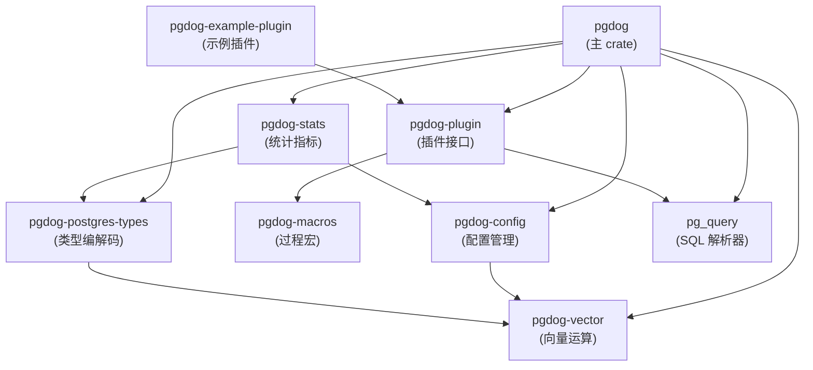

### 2.2 各 Crate 职责

| Crate | 职责 |
|-------|------|
| `pgdog` | 核心代理：前端监听、后端连接池、协议处理、查询路由、分片执行 |
| `pgdog-config` | 从 TOML 文件反序列化 `Config` / `User`，提供全局配置访问与热重载 |
| `pgdog-plugin` | 安全 FFI 接口，动态加载 `.so/.dylib` 插件，提供 `Plugin::route()` 回调 |
| `pgdog-macros` | `#[plugin]` / `#[init]` / `#[route]` / `#[fini]` 过程宏，消除 FFI 样板代码 |
| `pgdog-postgres-types` | `Datum` 枚举覆盖 15+ PG 类型（Bigint、Numeric、UUID、Vector 等），双向编解码 |
| `pgdog-stats` | `Counts` 结构体跟踪 22+ 指标（事务数、查询时间、带宽、错误数等） |
| `pgdog-vector` | `Vector` 类型（f32 数组），SIMD 加速的 L2 距离计算，质心分片路由 |

---

## 3. 主 Crate 模块结构

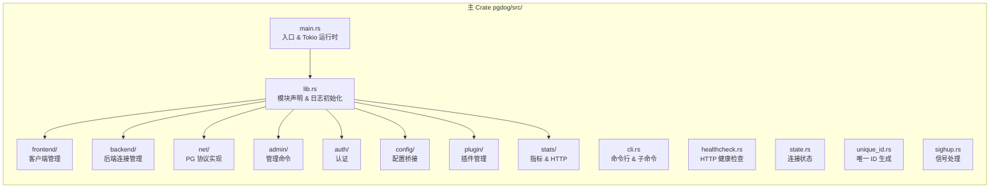

### 3.1 frontend/ — 客户端侧

```
frontend/
├── listener.rs              # TCP 监听器，accept 循环
├── client/
│   ├── mod.rs               # Client 生命周期（spawn → login → 主循环）
│   └── query_engine/
│       ├── mod.rs            # 查询执行引擎状态机
│       └── two_pc/           # 两阶段提交协调器
├── router/
│   ├── mod.rs                # Router 查询路由入口
│   ├── parser/               # SQL 解析 & 分片键提取（70+ 文件）
│   ├── sharding/             # 分片哈希算法
│   ├── copy.rs               # COPY 数据分片
│   └── search_path.rs        # Schema 分片路径
├── logical_transaction.rs   # 逻辑事务状态机
├── logical_session.rs       # 会话状态
├── prepared_statements.rs   # 客户端侧预编译语句缓存
├── comms.rs                 # 全局通信（shutdown、reload 信号）
├── client_request.rs        # 客户端请求抽象
├── buffered_query.rs        # 缓冲查询
└── stats.rs                 # 客户端侧统计
```

### 3.2 backend/ — 后端侧

```
backend/
├── server.rs                # 单个 PG 连接封装（TCP/TLS + 认证 + 协议）
├── databases.rs             # 全局集群注册表（init / reload / shutdown）
├── pool/
│   ├── pool_impl.rs         # Pool 连接池实现
│   ├── inner.rs             # 池内部状态（Mutex 保护）
│   ├── guard.rs             # RAII 连接守卫
│   ├── monitor.rs           # 三路维护循环
│   ├── cluster.rs           # Cluster：分片集合
│   ├── shard/               # Shard：主库 + 副本
│   ├── lb.rs                # 负载均衡器
│   ├── connection/
│   │   ├── mod.rs           # 客户端→服务端绑定（Binding）
│   │   ├── multi_shard/     # 多分片并发执行
│   │   └── aggregate.rs     # 跨分片结果聚合
│   ├── healthcheck.rs       # 连接健康检查
│   ├── lsn_monitor.rs       # 复制 LSN 监控
│   ├── dns_cache.rs         # DNS 缓存与 TTL 刷新
│   ├── request.rs           # 连接请求元数据
│   ├── taken.rs             # 已借出连接追踪
│   ├── waiting.rs           # 等待队列
│   └── state.rs             # 池状态快照
├── prepared_statements.rs   # 服务端预编译语句去重
├── protocol.rs              # 后端协议状态
├── replication/             # 逻辑复制（re-sharding）
├── schema/                  # Schema 同步
├── pub_sub/                 # PUB/SUB 代理
└── auth/                    # 后端认证（含 AWS RDS IAM）
```

### 3.3 net/ — 协议层

```
net/
├── messages/                # PostgreSQL 协议消息类型
│   ├── auth/                # 认证消息（MD5、SCRAM、Plain）
│   ├── hello.rs             # Startup / SSL 协商
│   ├── data_row.rs          # DataRow
│   ├── query.rs             # Query (Q)
│   ├── parse.rs             # Parse / Bind / Execute (P/B/E)
│   ├── error_response.rs    # ErrorResponse
│   └── ...                  # 30+ 消息类型
├── stream.rs                # 异步流（Plain / TLS 透明切换）
├── decoder.rs               # 二进制协议解码器
├── parameter.rs             # 服务端参数
├── tls.rs                   # TLS 配置（rustls）
├── tweaks.rs                # TCP socket 调优
└── discovery/               # 集群发现（UDP 广播）
```

---

## 4. 启动流程

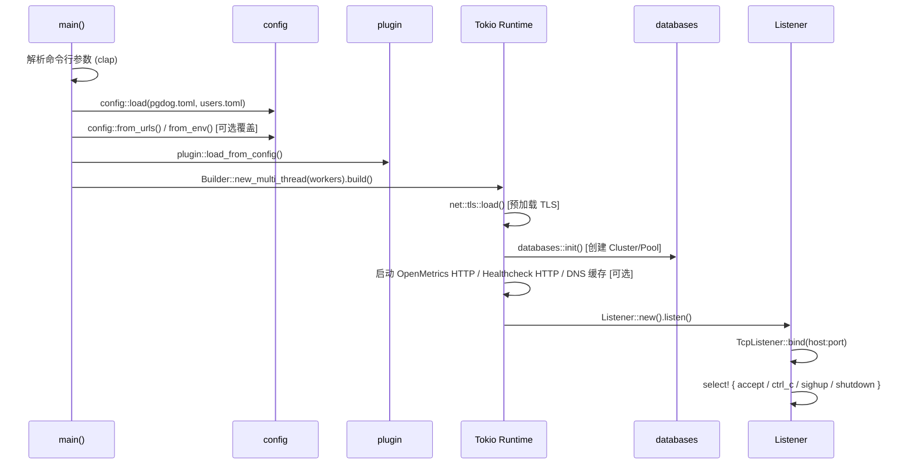

**关键设计决策**：

- **Tokio Runtime**：`workers=0` 时使用单线程 runtime，否则多线程（推荐每 CPU 2 个 worker）
- **内存分配器**：生产用 jemalloc (`tikv-jemallocator`)，测试用 `stats_alloc` 追踪内存
- **日志**：`tracing` + `tracing-subscriber`，环境变量 `RUST_LOG` 控制级别

---

## 5. 请求生命周期

这是 PgDog 最核心的数据流，从客户端 TCP 连接到返回结果的完整路径：

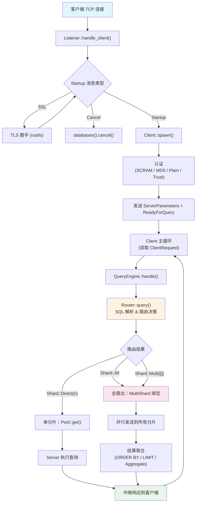

### 5.1 详细步骤

#### 第 1 阶段：连接建立

1. `Listener` 通过 `TcpListener::accept()` 接收新连接
2. 调用 `tweak()` 应用 TCP 调优（keepalive、拥塞控制等）
3. 读取 `Startup` 消息：
   - `Ssl`：进行 TLS 升级，然后重新读取
   - `GssEnc`：拒绝后等待普通启动
   - `Cancel`：转发取消请求到对应后端连接
   - `Startup`：进入 `Client::spawn()`
4. 使用 `comms.tracker().spawn()` 跟踪活跃连接（graceful shutdown 需要）

#### 第 2 阶段：认证

- 从 `users.toml` 查找匹配的用户和数据库
- 支持：SCRAM-SHA-256（默认）、MD5、明文、Trust
- 支持 passthrough 模式：将认证转发给后端 PostgreSQL 处理
- 支持 AWS RDS IAM Token 认证（后端侧）

#### 第 3 阶段：查询处理

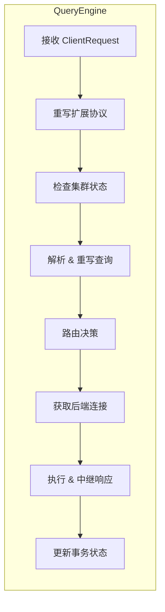

**QueryEngine** 是查询处理的核心状态机，其关键字段：

```rust
struct QueryEngine {
    backend: Connection,              // 后端连接绑定
    router: Router,                   // 路由状态
    comms: ClientComms,               // 协调通信
    begin_stmt: Option<BufferedQuery>, // 缓冲的 BEGIN 语句
    two_pc: TwoPc,                    // 两阶段提交状态
    transaction: Option<TransactionType>,
    streaming: bool,                  // COPY 模式标记
}
```

#### 第 4 阶段：路由

**Router** 委托 `QueryParser` 使用 `pg_query`（PostgreSQL 原生解析器的 Rust 绑定）解析 SQL：

1. 识别语句类型：SELECT / INSERT / UPDATE / DELETE / DDL
2. 提取 FROM 子句中的表名
3. 查找分片配置中的分片键列
4. 从 WHERE / VALUES / 绑定参数中提取分片键值
5. 通过哈希函数计算目标分片号
6. 返回 `Command` 枚举：

```rust
enum Command {
    Query(Route),      // 普通查询路由
    Parse(Prepare),    // 预编译语句
    Execute(Execute),  // 执行预编译语句
    Close(Close),      // 关闭预编译语句
    Copy(CopyHandler), // COPY 命令
}

enum Shard {
    Direct(usize),     // 单分片：直达 shard N
    Multi(Vec<usize>), // 多分片：IN 子句
    All,               // 全扇出：无分片键
}
```

#### 第 5 阶段：后端执行

- **单分片**：从对应 `Pool` 获取一个 `Server` 连接，转发查询，中继结果
- **多分片/全扇出**：
  1. `MultiShard` 绑定获取多个分片的连接
  2. 并行发送查询到所有目标分片
  3. 通过 `aggregate.rs` 合并结果：
     - 合并 DataRow 流
     - 执行归并排序（ORDER BY）
     - 应用 LIMIT / OFFSET
     - 重新计算聚合函数（COUNT / SUM / AVG / MIN / MAX / STDDEV / VARIANCE）
  4. 作为统一结果流返回客户端

---

## 6. 连接池架构

### 6.1 层次结构

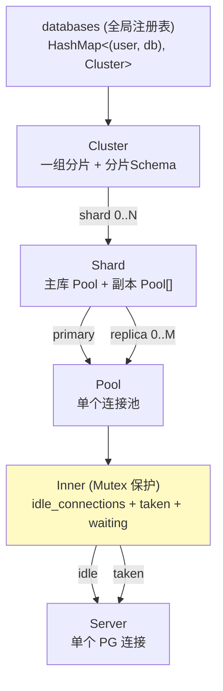

### 6.2 Pool 内部状态

```rust
struct Inner {
    idle_connections: Vec<Box<Server>>,    // 空闲连接
    taken: Taken,                          // 已借出连接（client_id → server_id 映射）
    waiting: VecDeque<Waiter>,             // 等待连接的客户端队列
    config: Config,                        // min / max / timeout 等
    online: bool,                          // 是否在线
    paused: bool,                          // 是否暂停
}
```

### 6.3 连接获取流程

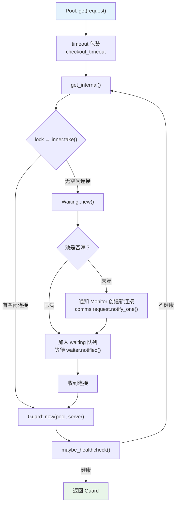

### 6.4 Monitor 三路维护循环

`Monitor` 为每个 Pool 启动三个并发任务：

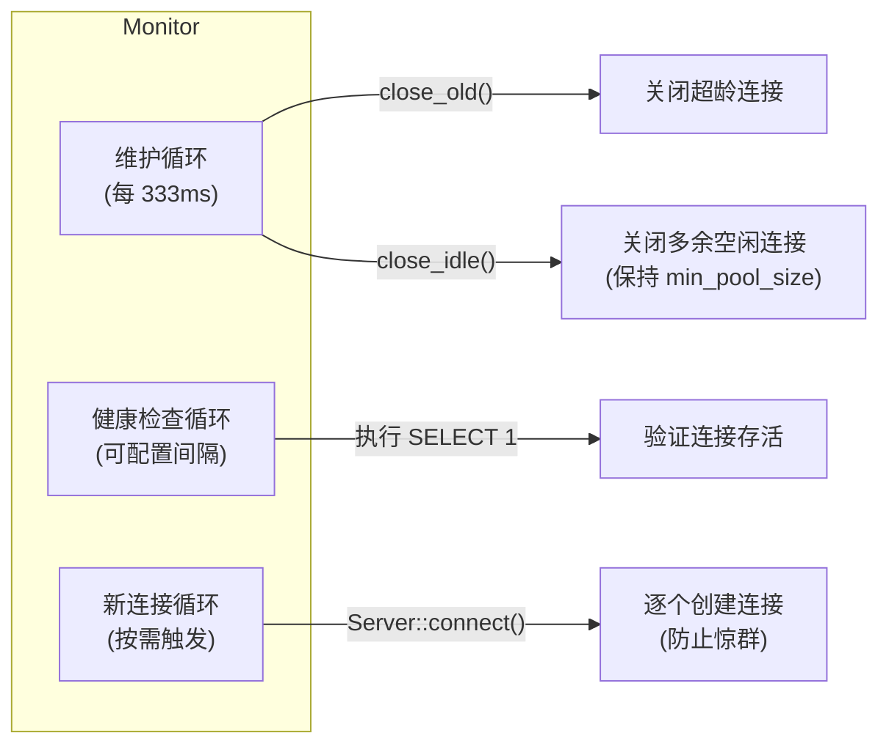

### 6.5 连接归还（Check-in）

`Pool::checkin()` 的决策树：

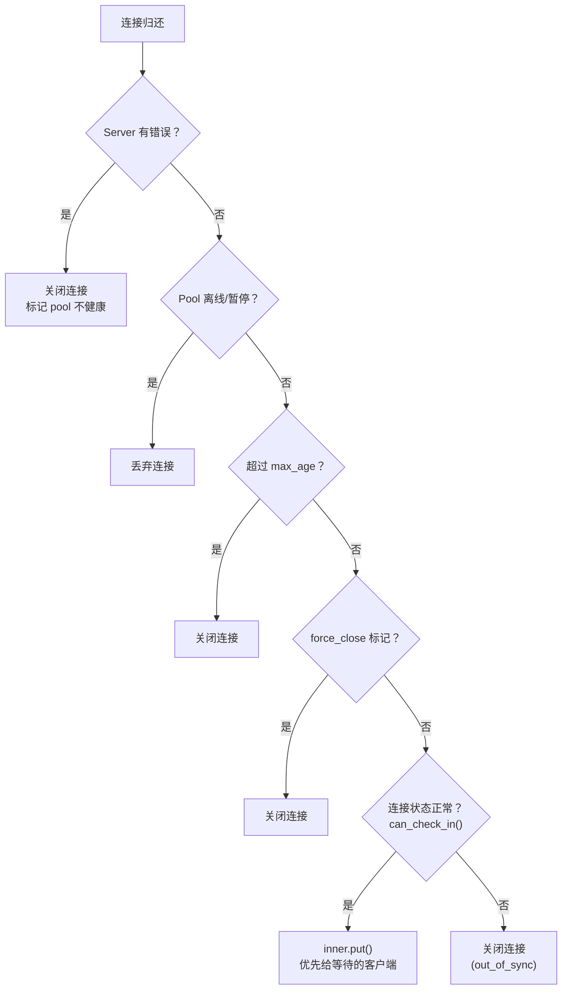

---

## 7. 负载均衡

### 7.1 读写分离

PgDog 使用 `pg_query` 解析器识别查询类型，自动路由：

| 查询类型 | 路由目标 |
|----------|----------|
| `SELECT`（非 `FOR UPDATE`） | 副本（负载均衡） |
| `INSERT` / `UPDATE` / `DELETE` / DDL | 主库 |
| `BEGIN` | 默认主库（除非 `BEGIN READ ONLY`） |
| `SET` / `SHOW` | 复用当前连接 |

策略配置 `read_write_strategy`：
- **conservative**：所有显式事务发到主库
- **aggressive**：检查事务内第一条查询判断读写

### 7.2 负载均衡策略

```rust
enum LoadBalancingStrategy {
    Random,                  // 随机选择
    LeastActiveConnections,  // 最少活跃连接数
    RoundRobin,             // 轮询
}
```

### 7.3 健康检查与故障转移

- **定期健康检查**：独立循环，不依赖客户端请求
- **借出前检查**：根据 `healthcheck_interval` 决定是否执行
- **自动 Ban/Unban**：不健康的数据库自动从轮转中移除，`ban_timeout` 后自动恢复
- **Failover**：监控复制 LSN，自动检测副本提升为主库

---

## 8. 分片架构

### 8.1 分片模式

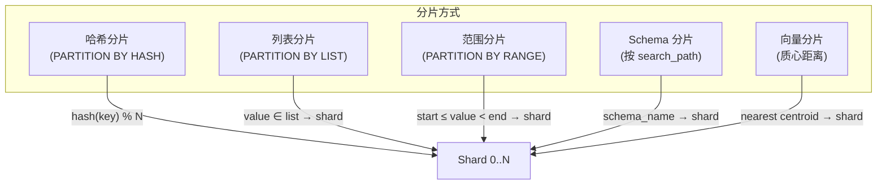

**哈希函数** 直接取自 PostgreSQL 源码，确保与 PG 原生分区表兼容：

```rust
// 支持的分片键类型
fn bigint(id: i64) -> u64   // BIGINT
fn uuid(id: Uuid) -> u64    // UUID
fn varchar(s: &str) -> u64  // VARCHAR
fn vector_l2(v: Vector, centroids: &[Vector]) -> usize  // 向量
```

### 8.2 跨分片查询执行

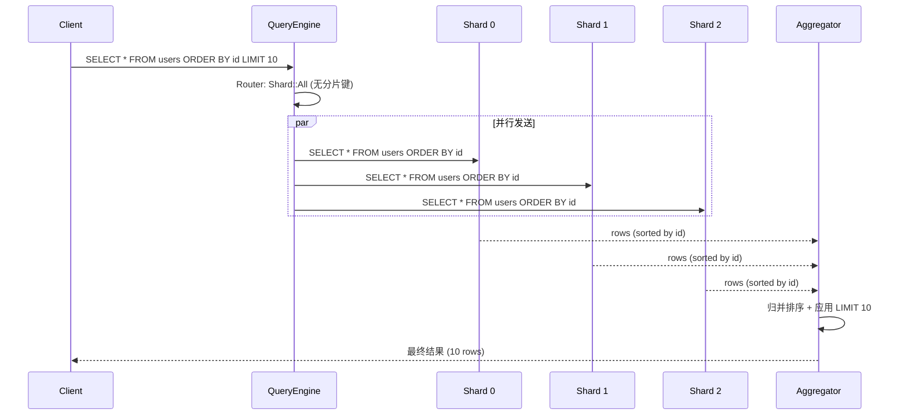

### 8.3 跨分片聚合

| 函数 | 处理方式 |
|------|----------|
| `COUNT(*)` | 各分片 COUNT 求和 |
| `SUM(col)` | 各分片 SUM 求和 |
| `AVG(col)` | 收集 SUM 和 COUNT，重新计算 |
| `MIN(col)` / `MAX(col)` | 取所有分片中的极值 |
| `STDDEV` / `VARIANCE` | 收集中间状态，重新计算 |

### 8.4 COPY 数据分片

PgDog 内置 CSV / 文本 / 二进制解析器，可以：
1. 解析 COPY 数据流中每一行
2. 提取分片键列的值
3. 计算目标分片
4. 将行自动分发到对应分片

### 8.5 两阶段提交（2PC）

保证跨分片写入的原子性：

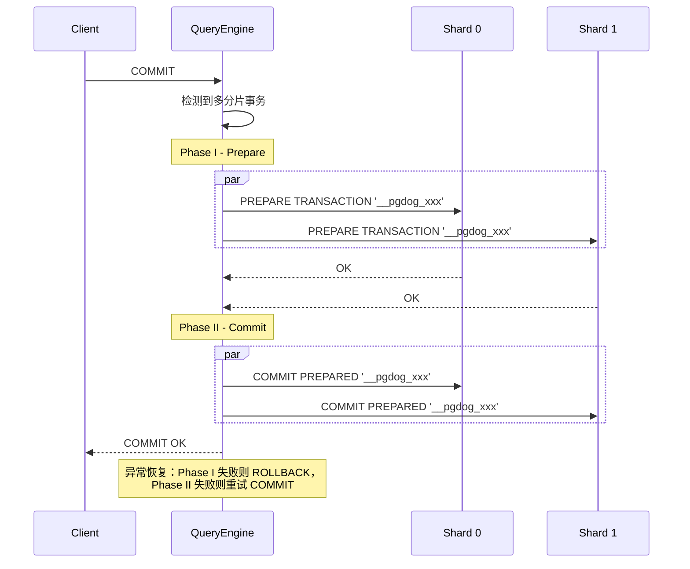

### 8.6 事务内分片约束

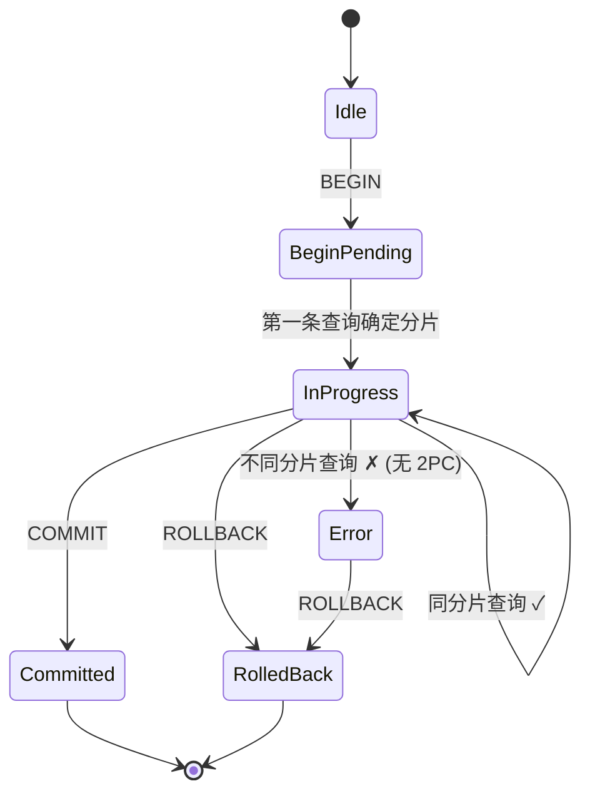

**关键不变量**：没有启用 2PC 时，事务内所有语句必须落在同一分片。`LogicalTransaction` 追踪事务的分片亲和性。

---

## 9. PostgreSQL 协议处理

### 9.1 协议状态机

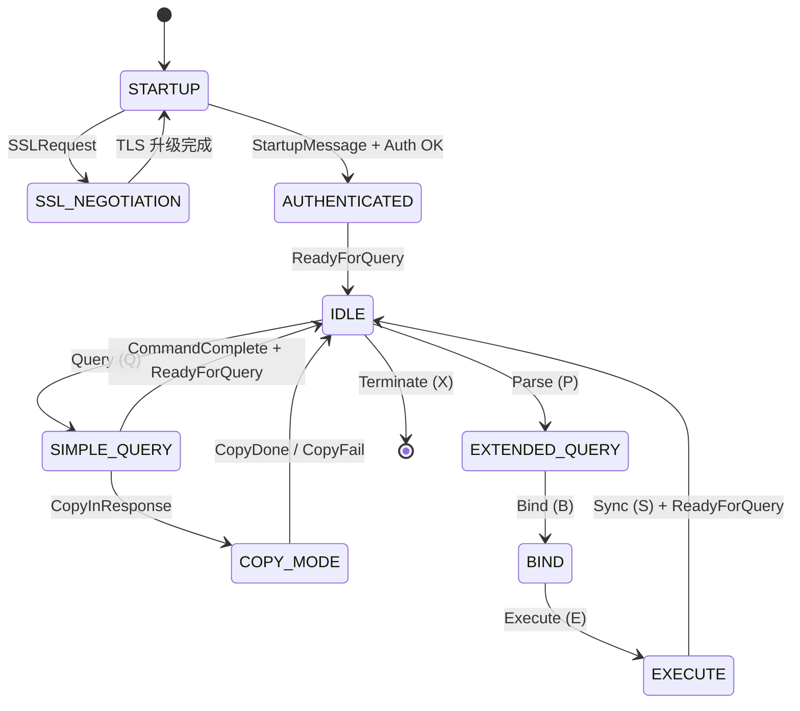

### 9.2 消息类型概览

| 方向 | 消息 | 代码 | 用途 |
|------|------|------|------|
| F→B | Query | Q | 简单查询 |
| F→B | Parse | P | 预编译语句 |
| F→B | Bind | B | 绑定参数 |
| F→B | Execute | E | 执行已绑定的门户 |
| F→B | Sync | S | 同步点 |
| F→B | CopyData | d | COPY 数据传输 |
| B→F | RowDescription | T | 列描述 |
| B→F | DataRow | D | 数据行 |
| B→F | CommandComplete | C | 命令完成 |
| B→F | ReadyForQuery | Z | 服务器就绪 |
| B→F | ErrorResponse | E | 错误 |
| B→F | ParameterStatus | S | 参数变更通知 |

### 9.3 预编译语句处理

PgDog 在事务模式下需要特殊处理预编译语句，因为不同客户端可能共享同一个后端连接：

- **客户端侧**（`frontend/prepared_statements.rs`）：维护语句名 → AST 映射
- **服务端侧**（`backend/prepared_statements.rs`）：跨客户端去重，避免重复 Parse
- **语句限制**：可配置 `prepared_statements_limit` 防止内存无限增长

---

## 10. 并发模型

### 10.1 Tokio 异步运行时

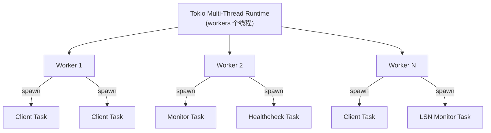

### 10.2 同步原语使用

| 原语 | 来源 | 用途 |
|------|------|------|
| `parking_lot::Mutex` | parking_lot | Pool 内部状态（`Inner`）— 临界区极短 |
| `parking_lot::RwLock` | parking_lot | LSN 统计（读多写少） |
| `tokio::sync::Notify` | tokio | Pool Monitor 唤醒 / shutdown 信号 |
| `Arc` | std | 跨 task 共享所有权 |
| `DashMap` | dashmap | 客户端连接追踪 |
| `OnceCell` | once_cell | 服务端参数懒初始化 |
| `arc_swap::ArcSwap` | arc_swap | 全局配置原子替换（热重载） |

### 10.3 关键设计模式

1. **Fast Path / Slow Path**：`Pool::get()` 先快速尝试获取空闲连接（仅需短暂锁），失败后进入慢路径（创建连接或排队等待）
2. **RAII Guard**：`Guard` 包裹 `Server`，Drop 时自动归还到池
3. **Notify 而非 Channel**：Monitor 使用 `Notify` 按需唤醒，避免无谓轮询
4. **逐个创建连接**：Monitor 一次只创建一个新连接，防止惊群效应
5. **Tracker**：`comms.tracker()` 跟踪所有活跃 client task，graceful shutdown 时等待全部完成

---

## 11. 配置系统

### 11.1 配置文件

| 文件 | 内容 |
|------|------|
| `pgdog.toml` | 主配置：通用设置、数据库集群、分片表、TCP 调优、TLS、管理接口 |
| `users.toml` | 用户凭据：用户名、密码、数据库映射、后端认证方式 |

### 11.2 热重载机制

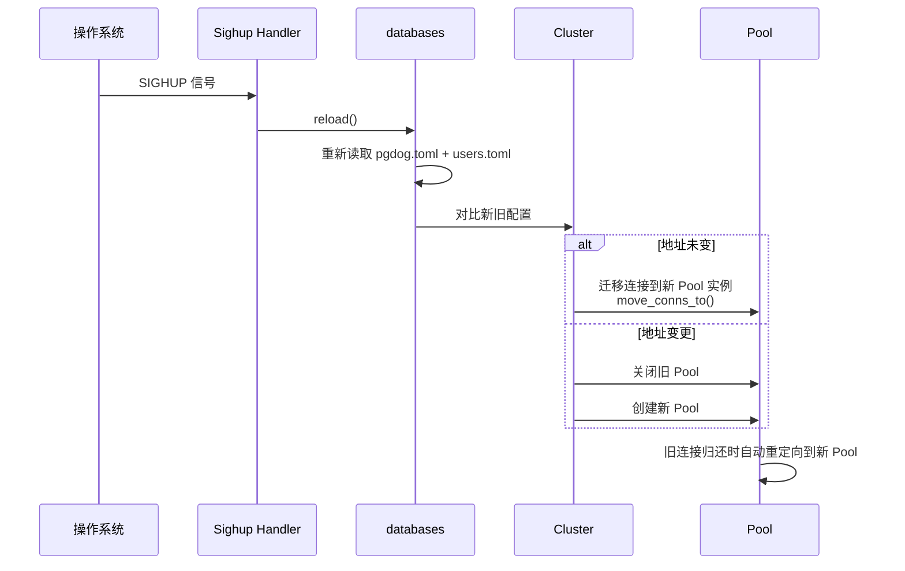

---

## 12. 插件系统

### 12.1 架构

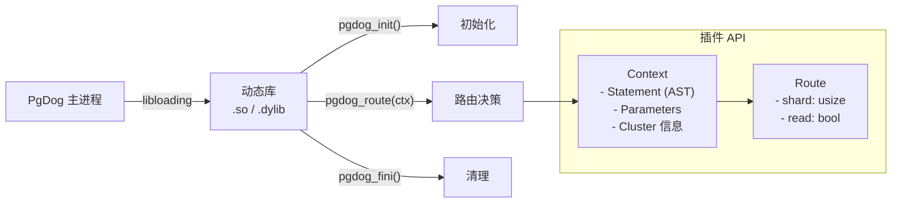

### 12.2 安全机制

- **版本兼容性检查**：加载时校验 Rust 编译器版本和 API 版本
- **宏生成 FFI**：`#[macros::route]` 自动生成 `extern "C"` 导出函数，消除手动 `unsafe` 风险
- **借用语义**：`Context` 中的数据使用 `Vec` 引用而非拷贝，减少开销

---

## 13. 监控与可观测性

### 13.1 指标体系

`pgdog-stats::Counts` 包含的核心指标：

| 类别 | 指标 | 说明 |
|------|------|------|
| 事务 | `xact_count` | 完成的事务总数 |
| 事务 | `xact_2pc_count` | 两阶段提交事务数 |
| 查询 | `query_count` | 执行的查询总数 |
| 查询 | `query_time` | 查询总耗时 |
| 网络 | `received` / `sent` | 收发字节数 |
| 连接 | `connect_time` / `connect_count` | 连接创建耗时/次数 |
| 等待 | `wait_time` | 客户端等待连接的总时间 |
| 错误 | `errors` | 错误连接数 |
| 负载均衡 | `reads` / `writes` | 读/写请求分布 |
| 预编译 | `prepared_statements_*` | 预编译语句命中/未命中 |

### 13.2 暴露方式

1. **OpenMetrics (Prometheus)**：通过 `openmetrics_port` 配置的 HTTP 端点暴露
2. **Admin 数据库**：兼容 PgBouncer 风格的管理接口（`SHOW POOLS` / `SHOW SERVERS` / `SHOW CLIENTS` 等）
3. **HTTP 健康检查**：独立端口，供 Kubernetes / 负载均衡器探测

---

## 14. 错误处理

### 14.1 错误类型层次

```
frontend::Error
├── Io(std::io::Error)
├── Net(net::Error)
├── Backend(backend::Error)
│   └── Pool(pool::Error)
│       ├── CheckoutTimeout     # 获取连接超时
│       ├── ConnectTimeout      # 创建连接超时
│       ├── Offline             # 池离线
│       ├── AllReplicasDown     # 所有副本不可用
│       ├── HealthcheckError    # 健康检查失败
│       └── ManualBan           # 手动禁止
├── Router(router::Error)       # 路由错误
├── Auth                        # 认证失败
└── Timeout                     # 通用超时
```

### 14.2 容错策略

| 场景 | 处理方式 |
|------|----------|
| 后端连接超时 | 标记 Pool 不健康，触发 ban，`ban_timeout` 后自动恢复 |
| 事务中后端错误 | 标记事务为错误状态，等待客户端 ROLLBACK |
| 废弃事务（客户端断开） | 自动执行 ROLLBACK（`rollback_timeout` 超时保护） |
| 连接不同步 | 丢弃连接，创建新连接替代 |
| 配置重载失败 | 保持旧配置不变，记录错误日志 |
| Graceful Shutdown | 等待活跃事务完成（`shutdown_timeout`），超时则发送 Cancel |

---

## 15. 性能优化要点

| 优化 | 实现 |
|------|------|
| 零拷贝消息传递 | 使用 `bytes::BytesMut` 避免不必要的内存分配 |
| jemalloc | 减少内存碎片，提升并发分配性能 |
| 连接复用 | 事务级池化，少量后端连接服务数千客户端 |
| 预编译语句去重 | 服务端侧跨客户端共享，减少 Parse 开销 |
| AST 缓存 | 相同 SQL 指纹的查询复用解析结果（`query_cache_limit`） |
| SIMD 向量距离 | SSE/AVX2/NEON 加速 L2 距离计算 |
| 并行跨分片执行 | 多分片查询同时发送，tokio 并发调度 |
| Fast Path 连接获取 | 空闲连接可用时仅需一次短暂 Mutex 锁 |
| 逐个创建连接 | 防止惊群效应，避免瞬间大量 TCP 连接 |
| DNS 缓存 | 可配置 TTL 的 DNS 缓存，减少 DNS 查询开销 |

---

## 16. 关键不变量总结

1. **事务分片亲和性**：无 2PC 时，事务内所有语句必须落在同一分片
2. **连接独占性**：被借出的连接在归还前独占于一个客户端
3. **参数一致性**：客户端 SET 参数会在后端连接切换时自动同步
4. **预编译语句作用域**：语句名在客户端侧唯一，在服务端侧去重
5. **协议同步**：客户端与服务端必须保持协议状态同步，否则连接被丢弃
6. **池容量约束**：`min_pool_size ≤ 活跃连接数 ≤ default_pool_size`
7. **2PC 原子性**：Phase I 失败全部 ROLLBACK，Phase II 失败重试 COMMIT
